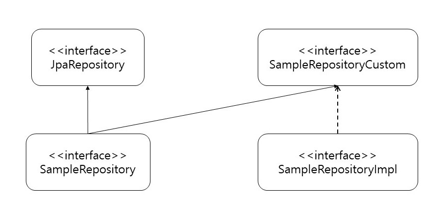

# 문화재 지도
[문화재 지도 프로젝트](https://github.com/uyeonH/CulturalPropertyMap) 리팩터링

### ERD
https://www.erdcloud.com/d/NgmS4iWyRNXB3kFhi

### 기능

- 문화재 서비스
    - 문화재 검색
    - 시대별 문화재 보기
    - 문화재 설명 태그화
  
- 사용자 개인 서비스
    - 검색 이력
    - 열람 이력
    - 문화재 추천
  

- 구글 로그인
- 카카오맵 API
- Etri 형태소 분석 API

### 기술셋

- Spring Boot 2.6.7
- Java 11
- gradle
- Thymeleaf
- Spring Data JPA
- QueryDsl
- AOP
- Spring Security
- Spring Batch
- Spring Validation
- ElasticSearch
- Docker
- Jenkins

### 오픈소스
- guava

### Tools
- Intellij
- Dbeaver

### 기술 상세
1. DB 접근을 위해 JPA, QueryDSL을 사용한다. 
   ORM으로 자바 표준 JPA를 사용하고, 동적 쿼리 생성을 위해 QueryDSL 사용
   
2. 로그 관리는 운영과 검증으로 나누어 작성, logback-*.xml에 상세 설정
   
3. 프로젝트 구조
   - 인프라 등 외부 요소가 변경되어도 Domain은 사용할 수 있도록 
   - global 패키지에서 공통으로 사용되는 config, aop, error 추상화
   - ErrorCode에 에러 분류, 오류 화면
   - model 패키지에 공통으로 사용되는 entity
   - API 응답으로 Domain을 그대로 내보내지 않는다. 반드시 DTO를 만들어 내보낸다. 
     [DTO 관리](https://song8420.tistory.com/m/383)
   - DDD 방법
   - 테스트 코드
   - Spring Validation을 사용해 값들을 검증
   - Spring Security, jwt를 활용하여 로그인, 인증
   - 메세지 국제화 messages.properties
   - 프론트단은 thymeleaf 활용
   - 도커에서 엘라스틱서치 

#### Repository 구성
SampleRepository extends JpaRepository, SampleRepositoryCustom // 인터페이스
SampleRepositoryImpl implements SampleRepositoryCustom // 구현클래스
- SampleRepository 가 JpaRepository, SampleRepositoryCustom 를 다중 상속하며 spring data jpa와 querydsl 용도 레포지토리로 나눈다.
- SampleRepositoryImpl는 SampleRepositoryCustom의 구현 클래스로 querydsl 용도이다.

AOP
- 로그 관리
  - TRACE  <  DEBUG  <  INFO  <  WARN  <  ERROR
- 로그인 관리

##### 참고자료
jwt 참고
https://webfirewood.tistory.com/115